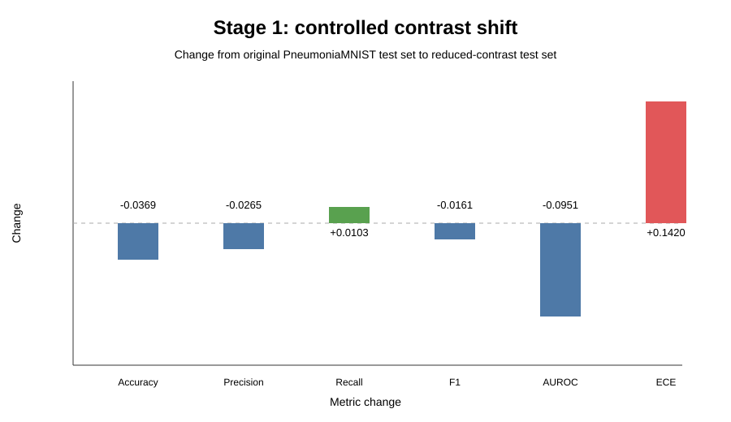
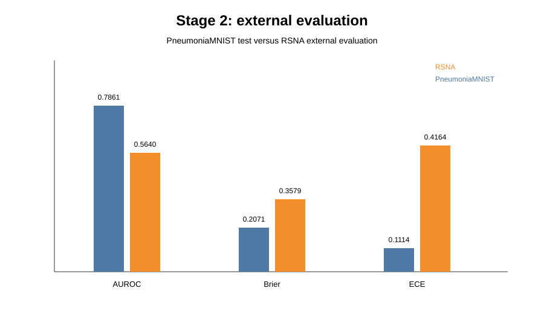

# Trustworthy AI for Medical Imaging

A research-preparation project investigating whether predictive performance, calibration, confidence and uncertainty remain reliable when a medical imaging model is evaluated under controlled and external distribution shift.

> **Research question:** How reliable is a medical imaging model when it is used outside the data it was originally trained on?

The project deliberately goes beyond accuracy. It studies **performance, calibration, confidence and model disagreement** across a sequence of controlled experiments.

---

## At a glance

| Stage | Experiment | Main question |
|---|---|---|
| 1 | PneumoniaMNIST baseline + reduced contrast | Does controlled image shift affect performance and calibration? |
| 2 | External RSNA evaluation | Does behaviour transfer to a different dataset? |
| 3 | Temperature scaling | Can post-hoc calibration improve probability quality? |
| 4 | Confidence/error analysis | Can the model be confidently wrong? |
| 5 | Five-model ensemble | Does model disagreement help identify errors? |

**Important:** the headline numbers below are the **recorded notebook results**. The corrected multi-seed workflow is now implemented as reusable source code, but it has not been claimed as executed because the required RSNA data and original local checkpoints are not present in this environment.

---

## Visual results

The `results/` directory contains compact summary figures for the main quantitative comparisons.



*Controlled reduced-contrast shift: the same model is evaluated before and after the image transformation.*



*External RSNA evaluation compared with the PneumoniaMNIST baseline.*


*Held-out RSNA reliability before and after temperature scaling.*

The executed notebooks contain the original visual record, including sample images, loss curves, reliability diagrams, confidence distributions and precision-recall analysis.

---

# Stage 1 — Baseline and controlled image shift

A small convolutional neural network (SmallCNN) was trained on **PneumoniaMNIST** using 64 × 64 grayscale inputs, PyTorch, binary classification and seed 42.

The goal was not to build a state-of-the-art classifier. The model provides a controlled setting for studying reliability.

### Baseline test results

| Metric | Original test set |
|---|---:|
| Accuracy | **0.6538** |
| Precision | **0.6505** |
| Recall | **0.9641** |
| F1 | **0.7769** |
| AUROC | **0.7861** |
| Brier score | **0.2071** |
| Expected Calibration Error (ECE) | **0.1114** |

### Controlled reduced-contrast experiment

The trained model was kept unchanged while the test images were modified using a **contrast factor of 0.5**.

This is a controlled stress test, **not a realistic hospital-to-hospital shift**.

| Metric | Original | Reduced contrast | Change |
|---|---:|---:|---:|
| Accuracy | 0.6538 | 0.6170 | -0.0369 |
| Precision | 0.6505 | 0.6240 | -0.0265 |
| Recall | 0.9641 | 0.9744 | +0.0103 |
| F1 | 0.7769 | 0.7608 | -0.0161 |
| AUROC | 0.7861 | 0.6909 | -0.0951 |
| Brier score | 0.2071 | 0.2828 | +0.0757 |
| ECE | 0.1114 | 0.2534 | +0.1420 |

The main observation is that both discrimination and probability quality deteriorated under the controlled image change.

---

# Stage 2 — External evaluation on RSNA

The Stage 1 model was reused **without retraining or fine-tuning** on an external RSNA dataset.

The external evaluation contained:

- **25,684 studies**
- **20,025 No Lung Opacity**
- **5,659 Lung Opacity**
- 25,684 matched DICOM images / study-level labels

The external target is **lung opacity**, whereas PneumoniaMNIST is a pneumonia classification task. These targets are related, but **not identical**. This is therefore an external-dataset stress test, not direct clinical validation.

| Metric | PneumoniaMNIST baseline | RSNA external evaluation |
|---|---:|---:|
| Accuracy | 0.6538 | **0.3639** |
| Precision | 0.6505 | **0.2373** |
| Recall | 0.9641 | **0.8521** |
| F1 | 0.7769 | **0.3712** |
| AUROC | 0.7861 | **0.5640** |
| Brier score | 0.2071 | **0.3579** |
| ECE | 0.1114 | **0.4164** |

At the fixed 0.50 threshold, classification performance fell substantially. Calibration also deteriorated markedly.

---

# Stage 3 — Temperature scaling

Stage 3 asks whether post-hoc calibration can improve probability quality without retraining the classifier.

The 25,684 RSNA predictions were split into two equal, stratified subsets:

- **12,842** for fitting the temperature
- **12,842** held out for evaluation

The learned temperature was **T = 2.0350**.

| Metric | Before | After | Change |
|---|---:|---:|---:|
| Brier score | 0.3590 | **0.3009** | -0.0582 |
| Log loss | 0.9685 | **0.8016** | -0.1669 |
| ECE | 0.4175 | **0.3566** | -0.0608 |
| AUROC | 0.5641 | **0.5641** | 0.0000 |

This demonstrates the distinction between **calibration and discrimination**: probability quality improved while AUROC remained unchanged.

---

# Stage 4 — Confidence and error analysis

On the full 25,684-study RSNA prediction set:

- **9,346 predictions were correct**
- **16,338 predictions were incorrect**
- Overall accuracy was **0.3639**

| Prediction outcome | Mean confidence | Median confidence |
|---|---:|---:|
| Correct | 0.6384 | 0.6041 |
| Incorrect | **0.6817** | **0.6588** |

Incorrect predictions were, on average, **more confident** than correct predictions.

There were **874 incorrect predictions with confidence ≥ 0.90**, representing **3.40% of all predictions**. The most confident incorrect prediction had confidence **0.9698**.

On the same external predictions, the notebook reports:

| Measure | Before | After temperature scaling |
|---|---:|---:|
| Mean confidence | 0.6659 | 0.5909 |
| Median confidence | 0.6369 | 0.5686 |
| High-confidence errors ≥ 0.90 | 874 | **0** |

The full-dataset Brier score improved from **0.3579 to 0.3003**, while AUROC remained **0.5640**.

---

# Stage 5 — Deep-ensemble disagreement

Five independently initialized copies of the same SmallCNN architecture were trained using seeds:

`42, 43, 44, 45, 46`

The standard deviation of the five predicted probabilities was used as a **model-disagreement proxy**.

The later, label-aligned uncertainty analysis reported:

| Outcome | Count | Mean disagreement | Median disagreement |
|---|---:|---:|---:|
| Correct | 10,880 | 0.101513 | 0.104394 |
| Incorrect | 14,804 | 0.093461 | 0.091569 |

Disagreement-based error-detection AUROC was **0.4225**.

The top 10% most-disagreeing cases had:

- 2,569 studies
- Error rate: **62.36%**
- Overall error rate: **57.64%**
- Difference: **+4.72 percentage points**

The result is intentionally retained as a **negative finding**: disagreement showed a weak signal in the highest-disagreement subset, but was not a reliable standalone error-ranking method.

### Alignment correction

The original Stage 5 notebook contains an earlier ensemble-performance path and a later explicitly aligned uncertainty path that do not produce the same ensemble accuracy. The earlier ensemble-performance values are therefore **not treated as definitive results**.

The corrected source workflow now enforces `StudyInstanceUID` alignment before ensemble analysis. It also adds comparison baselines and bootstrap confidence intervals.

---

# Main findings

1. **Controlled image changes can affect reliability.** Reduced contrast lowered AUROC from 0.7861 to 0.6909 and increased ECE from 0.1114 to 0.2534.

2. **External evaluation exposed substantial degradation.** Accuracy fell to 0.3639 and AUROC to 0.5640, while ECE increased to 0.4164.

3. **Calibration is not discrimination.** Temperature scaling improved Brier score, log loss and ECE while leaving AUROC unchanged.

4. **The model can be confidently wrong.** Incorrect predictions were more confident on average, including 874 errors with confidence at least 0.90.

5. **Uncertainty methods should be tested, not assumed to work.** The five-model disagreement analysis did not provide a reliable standalone error-ranking signal.

---

# Limitations

This is a **research-preparation study**, not a clinical validation study.

1. **Small baseline model:** deliberately simple CNN rather than a state-of-the-art medical imaging architecture.
2. **Different external targets:** PneumoniaMNIST is pneumonia classification; RSNA labels used here are study-level lung-opacity labels.
3. **Artificial image shift:** reduced contrast is a controlled stress test, not a realistic hospital shift.
4. **Limited ensemble size:** Stage 5 uses five models.
5. **Simple disagreement proxy:** standard deviation does not capture all forms of uncertainty.
6. **Single external dataset:** stronger robustness claims require multiple external datasets.
7. **Population shift:** PneumoniaMNIST is derived from pediatric chest radiographs, while the RSNA cohort is primarily adult. Age/population shift is therefore an important confounder.
8. **Image-only binary setting:** structured clinical information and multimodal inputs are not included.

---

# Corrected reproducibility workflow

The repository now contains a small `src/` package for the next rigorous rerun:

- `src/alignment.py` — identifier-based prediction/label alignment.
- `src/metrics.py` — centralised metrics and bootstrap confidence intervals.
- `src/calibration.py` — auditable temperature scaling.
- `src/stage5.py` — corrected ensemble analysis plus uncertainty baselines.
- `tests/` — unit tests for alignment and metrics.
- `docs/RESEARCH_PROTOCOL.md` — pre-specified analysis protocol.
- `.github/workflows/quality.yml` — automated compile and test checks.
- `data/README.md` — explicit external-data layout and non-redistribution policy.
- `CITATION.cff` — citation metadata.

The corrected workflow is **implemented but not claimed as executed**. The RSNA DICOM data and original model checkpoints are not available in this environment, so no new numerical results are invented.

---

# Repository structure

```text
trustworthy-ai-medical-imaging/
├── notebooks/
├── research_notes/
├── results/
├── src/
│   ├── alignment.py
│   ├── calibration.py
│   ├── metrics.py
│   ├── stage5.py
│   └── README.md
├── tests/
├── data/
│   └── README.md
├── docs/
│   └── RESEARCH_PROTOCOL.md
├── FINAL_RESEARCH_SUMMARY.md
├── SETUP.md
├── requirements.txt
├── pyproject.toml
├── CITATION.cff
└── README.md
```

Medical datasets and model checkpoints are **not committed** to the repository.

---

# Running the checks

```bash
python -m pip install -e .
pytest -q
```

For the corrected Stage 5 analysis:

```bash
python -m src.stage5 \
  --labels data/rsna/labels.csv \
  --predictions data/predictions/seed42.csv data/predictions/seed43.csv data/predictions/seed44.csv data/predictions/seed45.csv data/predictions/seed46.csv
```

---

# Data and claims boundary

Stage 1 uses PneumoniaMNIST through MedMNIST. The RSNA dataset must be obtained separately.

This project does **not** establish clinical safety, clinical usefulness, hospital-level generalisation, or a validated pneumonia detector.

Its current contribution is methodological: documenting how calibration, confidence and uncertainty can fail under dataset change, while providing a reproducible framework for a more rigorous multi-seed study.

## Status

**Research preparation: Stages 1–5 documented; corrected reanalysis workflow implemented.**

Next scientific extensions include additional calibration methods, stronger uncertainty estimation, multiple external datasets, realistic cross-site shifts, structured clinical variables and multimodal modelling.
