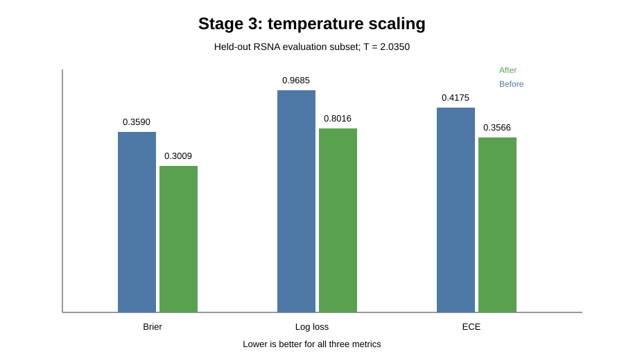

# Trustworthy AI for Medical Imaging

A research-preparation project investigating whether confidence and uncertainty remain reliable when a medical imaging model is evaluated under changed image appearance and external data.

> **Research question:** How reliable is a medical imaging model when it is used outside the data it was originally trained on?

The project deliberately goes beyond accuracy. It studies **performance, calibration, confidence, and model disagreement** across a sequence of controlled experiments.

---

## What this project investigates

A medical model can still produce a prediction when the input distribution changes. The more important question is whether the **prediction and the confidence attached to it remain trustworthy**.

This project therefore asks:

- Does a controlled change in image appearance affect model performance?
- Does performance transfer to an external dataset?
- Are the model's probabilities calibrated?
- Can the model be highly confident when it is wrong?
- Can disagreement between independently trained models provide a useful uncertainty signal?

---

## Research pipeline

```text
Stage 1
PneumoniaMNIST baseline
        │
        ▼
Controlled reduced-contrast shift
        │
        ▼
Stage 2
External evaluation on RSNA
        │
        ▼
Stage 3
Temperature scaling
        │
        ▼
Stage 4
Confidence and error analysis
        │
        ▼
Stage 5
Deep-ensemble disagreement
```

Each stage uses the output of the previous stage so that the investigation moves from basic model behaviour toward reliability under external shift.

---

# Stage 1 — Baseline and controlled image shift

## Baseline model

A small convolutional neural network (SmallCNN) was trained on **PneumoniaMNIST**.

The purpose was not to build a state-of-the-art medical imaging classifier. The model provides a controlled experimental setting for studying prediction quality and confidence.

The notebook uses:

- PneumoniaMNIST
- 64 × 64 grayscale inputs
- PyTorch
- Binary classification
- A fixed random seed of 42
- A training / validation / test split supplied by PneumoniaMNIST

### Example PneumoniaMNIST images

The Stage 1 notebook contains the actual PneumoniaMNIST image grid generated during the experiment. [Open the Stage 1 notebook](notebooks/01_pneumoniamnist_baseline_and_shift_clean.ipynb) to view it.

## Baseline test results

| Metric | Original test set |
|---|---:|
| Accuracy | **0.6538** |
| Precision | **0.6505** |
| Recall | **0.9641** |
| F1 | **0.7769** |
| AUROC | **0.7861** |
| Brier score | **0.2071** |
| Expected Calibration Error (ECE) | **0.1114** |

The model has relatively high recall, while the calibration analysis shows that its confidence is not perfectly aligned with observed accuracy.

### Reliability diagram

The Stage 1 notebook also contains the executed reliability diagram. [Open the Stage 1 notebook](notebooks/01_pneumoniamnist_baseline_and_shift_clean.ipynb) to view the original plot.

## Controlled reduced-contrast experiment

The trained model was kept unchanged while the test images were modified using a **contrast factor of 0.5**.

This is intentionally a controlled stress test. It is **not** intended to reproduce a real hospital-to-hospital distribution shift.

The Stage 1 notebook contains the executed side-by-side original/reduced-contrast image comparison. [Open the Stage 1 notebook](notebooks/01_pneumoniamnist_baseline_and_shift_clean.ipynb) to view the original figure.

### Original vs reduced-contrast results

| Metric | Original | Reduced contrast | Change |
|---|---:|---:|---:|
| Accuracy | 0.6538 | 0.6170 | -0.0369 |
| Precision | 0.6505 | 0.6240 | -0.0265 |
| Recall | 0.9641 | 0.9744 | +0.0103 |
| F1 | 0.7769 | 0.7608 | -0.0161 |
| AUROC | 0.7861 | 0.6909 | -0.0951 |
| Brier score | 0.2071 | 0.2828 | +0.0757 |
| ECE | 0.1114 | 0.2534 | +0.1420 |

The most important changes are the drop in **AUROC** and the worsening of both **Brier score** and **ECE**. The model's ranking ability and probability quality both deteriorated under the controlled image change.

### Precision-recall curve

The Stage 1 notebook contains the executed precision-recall curve. [Open the Stage 1 notebook](notebooks/01_pneumoniamnist_baseline_and_shift_clean.ipynb) to view it.

---

# Stage 2 — External evaluation on RSNA

The Stage 1 model was reused **without retraining or fine-tuning** on an external RSNA dataset.

The external evaluation contained:

- **25,684 studies**
- **20,025 No Lung Opacity**
- **5,659 Lung Opacity**
- 25,684 matched DICOM images / study-level labels

The external target is **lung opacity**, whereas PneumoniaMNIST is a pneumonia classification task. These targets are related, but they are **not identical**. Therefore this experiment should be described as an external-dataset stress test, not as direct clinical validation.

### External evaluation

| Metric | PneumoniaMNIST baseline | RSNA external evaluation |
|---|---:|---:|
| Accuracy | 0.6538 | **0.3639** |
| Precision | 0.6505 | **0.2373** |
| Recall | 0.9641 | **0.8521** |
| F1 | 0.7769 | **0.3712** |
| AUROC | 0.7861 | **0.5640** |
| Brier score | 0.2071 | **0.3579** |
| ECE | 0.1114 | **0.4164** |

The external evaluation shows a substantial reduction in classification performance and a much larger calibration error.

The important point is not simply that accuracy fell. **The confidence quality also degraded.**

---

# Stage 3 — Temperature scaling

Stage 3 asks whether post-hoc calibration can improve probability quality without retraining the classifier.

The 25,684 RSNA predictions were split into two equal, stratified subsets:

- **12,842 observations** for fitting the temperature
- **12,842 observations** held out for evaluation

The learned temperature was:

**T = 2.0350**

Temperature scaling was applied to the logits using:

```text
calibrated probability = sigmoid(logit / T)
```

The classifier itself was not retrained.

## Held-out calibration results

| Metric | Before | After | Change |
|---|---:|---:|---:|
| Brier score | 0.3590 | **0.3009** | -0.0582 |
| Log loss | 0.9685 | **0.8016** | -0.1669 |
| ECE | 0.4175 | **0.3566** | -0.0608 |
| AUROC | 0.5641 | **0.5641** | 0.0000 |



### What this shows

Temperature scaling improved the quality of the probabilities on the held-out RSNA subset:

- Brier score decreased.
- Log loss decreased.
- ECE decreased.
- AUROC remained unchanged.

This is an important distinction:

> **Calibration and discrimination are different properties of a model.**

A model can become better calibrated without becoming better at ranking positive and negative cases.

---

# Stage 4 — Confidence and error analysis

Stage 4 examines whether the model's confidence is actually informative about correctness.

On the full 25,684-study RSNA prediction set:

- **9,346 predictions were correct**
- **16,338 predictions were incorrect**
- Overall accuracy was **0.3639**

### Confidence comparison

| Prediction outcome | Mean confidence | Median confidence |
|---|---:|---:|
| Correct | 0.6384 | 0.6041 |
| Incorrect | **0.6817** | **0.6588** |

The incorrect predictions were, on average, **more confident** than the correct predictions.

That is one of the clearest trustworthy-AI findings in this project.

### High-confidence errors

There were:

- **874 incorrect predictions with confidence ≥ 0.90**
- **3.40% of all RSNA predictions**

The most confident incorrect prediction had confidence **0.9698**.


### Effect of temperature scaling on confidence

On the same external predictions, the notebook reports:

| Measure | Before | After |
|---|---:|---:|
| Mean confidence | 0.6659 | 0.5909 |
| Median confidence | 0.6369 | 0.5686 |
| High-confidence errors (≥0.90) | 874 | **0** |

The corresponding probability-quality metrics improved:

| Metric | Before | After |
|---|---:|---:|
| Brier score | 0.3579 | 0.3003 |
| Log loss | 0.9652 | 0.8003 |
| AUROC | 0.5640 | 0.5640 |

These full-dataset numbers are kept separate from the Stage 3 held-out evaluation numbers because they answer a different question.

---

# Stage 5 — Deep-ensemble disagreement

Stage 5 asks whether model disagreement can provide an additional uncertainty signal.

Five independently initialized copies of the same SmallCNN architecture were trained using seeds:

```text
42, 43, 44, 45, 46
```

The models were evaluated on the same external RSNA images. For each study, the standard deviation of the five predicted probabilities was used as a **model-disagreement proxy**.

### Disagreement analysis

Using the later, label-aligned uncertainty analysis in the notebook:

| Outcome | Count | Mean disagreement | Median disagreement |
|---|---:|---:|---:|
| Correct | 10,880 | 0.101513 | 0.104394 |
| Incorrect | 14,804 | 0.093461 | 0.091569 |

The disagreement-based error-detection AUROC was:

**0.4225**

A value below 0.50 means that, in this experiment, higher disagreement did **not** reliably correspond to incorrect predictions.

The top 10% most-disagreeing cases had:

- 2,569 studies
- Error rate: **62.36%**
- Overall error rate: **57.64%**
- Difference: **+4.72 percentage points**

So the highest-disagreement group contained somewhat more errors, but the full ranking signal was not reliable.

The notebook also found **no cases** that simultaneously met:

- ensemble confidence ≥ 0.90
- top-10% disagreement threshold

## Important Stage 5 note

The Stage 5 notebook contains two different label-alignment paths. Its earlier ensemble-performance block reports a separate set of ensemble accuracy/AUROC/Brier/log-loss values, while the later uncertainty analysis uses `all_labels` and reports accuracy of 0.4236.

Because these two paths do not produce the same accuracy, this README **does not treat the earlier Stage 5 ensemble-performance table as a definitive result**. The uncertainty findings above are reported from the later, explicitly aligned uncertainty-analysis section.

This is intentionally documented rather than hidden.

---

# Main findings

## 1. Image appearance changes can affect reliability

Reducing contrast from the original PneumoniaMNIST test images reduced AUROC from **0.7861 to 0.6909** and increased ECE from **0.1114 to 0.2534**.

## 2. External evaluation exposed substantial degradation

When the Stage 1 model was used on the external RSNA dataset without retraining, accuracy fell to **0.3639** and AUROC to **0.5640**, while ECE increased to **0.4164**.

## 3. Calibration is not the same as discrimination

Temperature scaling improved Brier score, log loss and ECE on the held-out RSNA subset, while AUROC remained **0.5641**.

## 4. The model can be confidently wrong

On the external dataset, incorrect predictions had higher mean confidence than correct predictions, and **874 incorrect predictions** had confidence of at least 0.90.

## 5. Uncertainty methods should be tested, not assumed to work

The five-model disagreement analysis did not provide a reliable standalone error-ranking signal. Its AUROC for detecting incorrect predictions was **0.4225**.

The negative result is important. A trustworthy-AI investigation should be willing to retain methods that do not work as expected.

---

# Why these experiments matter

The project illustrates a central issue in trustworthy medical AI:

> A prediction can be wrong while still looking confident.

Accuracy alone would not reveal this.

A model can have:

- acceptable performance on its development distribution,
- degraded performance under external evaluation,
- poor calibration under shift,
- and high confidence on incorrect cases.

For this reason, the project treats **discrimination, calibration, confidence and uncertainty as separate properties** that need to be evaluated together.

---

# Limitations

This project is a **research-preparation study**, not a clinical validation study.

Important limitations include:

1. **Small baseline model**  
   The experiments use a deliberately small CNN rather than a state-of-the-art medical imaging architecture.

2. **Different external targets**  
   PneumoniaMNIST is a pneumonia classification dataset, while the RSNA external labels used here are study-level lung-opacity labels. They are related but not identical.

3. **Artificial image shift**  
   The reduced-contrast experiment is a controlled stress test. It should not be interpreted as a realistic hospital-to-hospital shift.

4. **Limited ensemble size**  
   Stage 5 uses only five independently trained models.

5. **Simple disagreement proxy**  
   Prediction standard deviation measures model disagreement but is not a complete treatment of epistemic and aleatoric uncertainty.

6. **Single external dataset**  
   Stronger claims about robustness would require multiple external datasets and more realistic cross-site evaluation.

7. **Binary image-only setting**  
   The experiments do not incorporate structured clinical information or multimodal inputs.

---

# Repository structure

```text
trustworthy-ai-medical-imaging/
│
├── notebooks/
│   ├── 01_pneumoniamnist_baseline_and_shift.ipynb
│   ├── 01_pneumoniamnist_baseline_and_shift_clean.ipynb
│   ├── 02_rsna_external_evaluation.ipynb
│   ├── 02_rsna_external_evaluation_clean.ipynb
│   ├── 03_temperature_scaling_calibration.ipynb
│   ├── 03_temperature_scaling_calibration_clean.ipynb
│   ├── 04_confidence_and_uncertainty_analysis.ipynb
│   └── 05_uncertainty_estimation.ipynb
│
├── research_notes/
│   ├── STAGE1_RESULTS.md
│   ├── STAGE2_RESULTS.md
│   ├── STAGE3_RESULTS.md
│   ├── STAGE4_RESULTS.md
│   └── STAGE5_RESULTS.md
│
├── results/
│   ├── stage1_shift_metrics.svg
│   ├── stage2_external_vs_stage1.svg
│   └── stage3_temperature_scaling.svg
│
├── FINAL_RESEARCH_SUMMARY.md
├── SETUP.md
├── requirements.txt
└── README.md
```

---

# Data

The medical datasets are **not redistributed in this repository**.

Stage 1 uses PneumoniaMNIST through the MedMNIST package.

The RSNA data used for external evaluation must be obtained separately and are not stored in the repository.

---

# Reproducibility

The notebooks contain the experimental code, validation checks, saved prediction workflows and notebook outputs used to produce the reported results.

The clean notebooks are organized so that the stages can be followed in order:

1. Run Stage 1 to train the baseline and evaluate the controlled image shift.
2. Run Stage 2 to generate external RSNA predictions.
3. Run Stage 3 to fit and evaluate temperature scaling.
4. Run Stage 4 to analyse confidence and errors.
5. Run Stage 5 to train the ensemble and analyse model disagreement.

The original experiments were run in a Windows environment with the RSNA data stored separately. The repository therefore does not contain the medical data or model checkpoints.

---

# A note about execution in this review

The uploaded notebooks contain executed outputs from the original experimental runs, including the image grids, reliability plots, metrics and Stage 5 analysis. I checked those stored outputs against the notebook code while rebuilding this README.

A completely fresh end-to-end execution is not claimed here because the uploaded environment does not contain the original RSNA DICOM dataset and the original Windows data paths referenced by Stages 2–5. The README therefore reports the **actual recorded notebook results**, rather than inventing a new rerun.

---

# Status

**Research preparation: Stages 1–5 completed and documented.**

The next useful extensions would be:

- additional calibration methods,
- stronger uncertainty estimation,
- multiple external datasets,
- more realistic cross-site shifts,
- structured clinical variables,
- multimodal modelling,
- and evaluation of whether uncertainty estimates remain useful under hospital-level distribution shift.

---

## Project focus

This project is not trying to answer:

> “Can a model classify pneumonia?”

It is asking the more difficult question:

> **“When the model is wrong, does it know that it might be wrong?”**

That is the reliability problem this project is designed to investigate.
